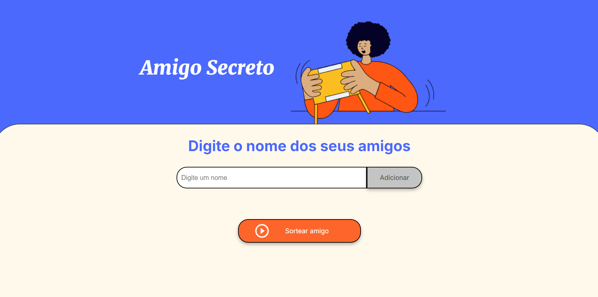
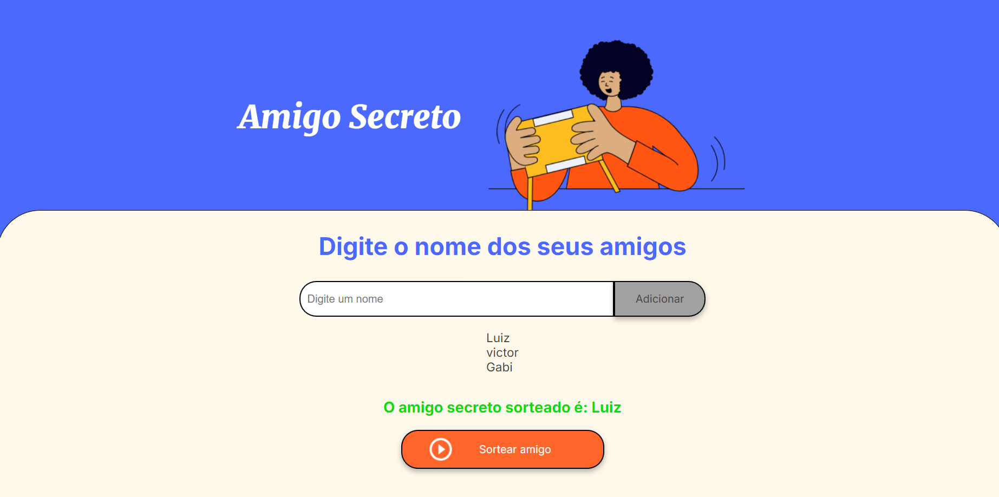

# Amigo Secreto Alura

  

Nosso projeto tem como objetivo reforçar o conhecimento sobre lógica de programação então para isso utilizamos o JavaScript
para dar vida ao "programa" de seleção de nomes aleatoriamente, como podemos ver na imagem acima temos o espaço para botar o nome que quisermos e esses nomes irão aparecer abaixo em forma de lista onde o ultimo nome adicionado vai ser o primeiro da lista, e ao apertar o botão de sortear amigo um nome dessa lista é escolhido.

  
